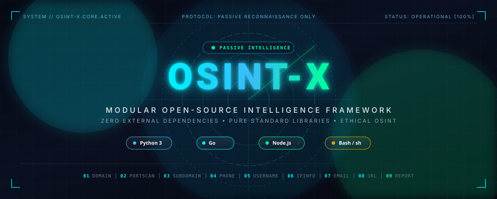

<p align="center">
  
</p>

# OSINT-X

Consola modular de inteligencia pasiva en cuatro lenguajes: Python, Go, JavaScript y Shell. Nueve módulos aislados que consultan únicamente información pública y objetivos autorizados, con resultados estructurados que alimenta una capa común de reportes.

> Uso responsable: solo dominios e IPs propios o con autorización. Sin exploits, sin logins, sin fuerza bruta.

## Requisitos

| Lenguaje | Versión mínima | Dependencias | Verificado en |
|---|---|---|---|
| Python | 3.10 | Ninguna (solo biblioteca estándar) | 3.14.7 |
| Go | 1.21 | Ninguna (solo estándar) | 1.27.1 |
| JavaScript | Node 18 | Ninguna (cero dependencias) | Node 24 |
| Shell | Git Bash o Linux | `curl`, `jq` | Git Bash |

Sin claves de API para las fuentes incluidas. Sin variables de entorno.

## Instalación

```bash
git clone https://github.com/hackcrist/OSINT-X.git
cd OSINT-X
```

No hay paso de instalación adicional: cada implementación usa lo estándar de su lenguaje.

```bash
# Python: nada que instalar
cd src/python
python cli.py

# Go: compilar una vez (opcional, también funciona con go run .)
cd src/go
go build -o osintx.exe .

# JavaScript: nada que instalar
cd src/js
node cli.mjs

# Shell: dar permiso una vez (solo Linux/macOS)
cd src/shell
chmod +x osintx.sh
./osintx.sh
```

## Uso

El menú acepta `1`–`9` o `01`–`09`; `00` sale. Cada opción pide su objetivo y muestra el resultado con estado (`ok`, `partial`, `error`), fuentes y hora de obtención.

```bash
# Ejemplos por módulo (opción + objetivo)
01  example.com        # DOMAIN: DNS, registros, RDAP
02  93.184.216.34      # PORTSCAN: solo host autorizado
03  example.com        # SUBDOMAIN: enumeración pasiva
04  +34123456789       # PHONE: formato y metadatos
05  torvalds           # USERNAME: presencia pública
06  8.8.8.8            # IPINFO: ASN, ISP, geo aproximada
07  alguien@ejemplo.com# EMAIL: verificación y metadatos
08  https://ejemplo.com# URL: análisis del enlace
09                     # REPORT: guarda el último resultado (JSON, TXT o HTML)
```

Atajo solo en Shell (módulo + objetivo en una línea):

```bash
./osintx.sh 01 example.com
```

Los reportes se guardan en `reports/` dentro de cada implementación (`src/python/reports/`, `src/js/reports/`, `src/shell/reports/`).

## Módulos

| Código | Módulo | Contenido |
|---|---|---|
| 01 | DOMAIN | DNS, registros MX/TXT/NS, IPs asociadas, WHOIS/RDAP |
| 02 | PORTSCAN | Puertos TCP, servicios, banners, versiones |
| 03 | SUBDOMAIN | Enumeración pasiva, transparencia de certificados, DNS, wordlists |
| 04 | PHONE | Formato, país, operador y metadatos públicos |
| 05 | USERNAME | Presencia pública en plataformas y enlaces |
| 06 | IPINFO | ASN, ISP y geolocalización aproximada |
| 07 | EMAIL | Verificación y metadatos públicos |
| 08 | URL | Análisis de enlaces |
| 09 | REPORT | Guarda el último resultado en JSON, TXT o HTML |
| 00 | EXIT | Salida |

## Notas

- En redes con filtro TLS, el DoH a `cloudflare-dns.com` puede fallar con error SSL; el DNS del sistema sigue resolviendo y el estado sale `partial` en vez de `ok`.
- Los sitios con login o JavaScript pesado pueden marcarse como indicio: verificar a mano.
- Estimaciones de ASN, operador y geolocalización son aproximadas según la fuente.

## Cómo funciona todo

Cada implementación sigue el mismo ciclo: el menú pide un objetivo, el módulo lo valida, consulta fuentes públicas con tiempo límite, normaliza a `{status, target, data, sources, errors, retrieved_at}` y lo muestra. La opción 09 persiste ese último resultado en JSON, TXT o HTML.

Las cuatro implementaciones son independientes: no comparten código, solo el contrato de salida. Python usa `urllib` y `socket`, Go usa `net` y goroutines con contexto, JavaScript usa `dns/promises` y `fetch`, Shell usa `curl`, `dig`/`nslookup` y `jq`.

## Autor

**Crist Code** — https://github.com/hackcrist/OSINT-X

## Documentación

Manuales en `docs/`: [índice](docs/index.md), arquitectura, uso por lenguaje y referencia de módulos y errores.
