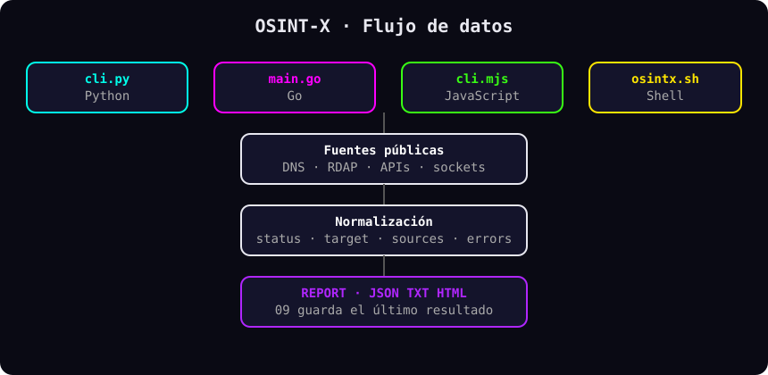

# Flujo de Datos

Recorrido de una consulta desde la entrada hasta el reporte, con tiempos y límites reales del código.

---

## Especificación Técnica

### Ciclo por implementación

| Fase | Python | Go | JavaScript | Shell |
| :--- | :--- | :--- | :--- | :--- |
| Entrada | `cli.py` menú 01-09 | `main.go` menú 01-09 | `cli.mjs` menú | `osintx.sh` menú o atajo |
| Validación | `validate_domain` en `common.py` | `isValidDomain` en `domain.go` | `normalizeDomain` en `common.mjs` | validación en cada módulo |
| Red | `urllib` con timeout por llamada | `httpGet` y `lookupWithTimeout` (5 s, `DefaultTimeout`) | `fetch`/`dns` con 8-10 s | `curl -m ${OSINTX_TIMEOUT:-10}` |
| Normalización | `make_result` en `common.py` | `NewResult` en `common.go` | `makeResult` en `common.mjs` | funciones de `lib/common.sh` |
| Salida | Tabla JSON en pantalla | JSON por stdout | JSON en consola | Texto y JSON |
| Reporte | `report.save` a `reports/` | `report.go` | `report.mjs` | `report.sh` a `reports/` |

### Tiempos de espera observados

| Origen | Valor |
| :--- | :--- |
| Go `DefaultTimeout` | 5 segundos |
| Shell `OSINTX_TIMEOUT` | 10 segundos por defecto |
| JS DNS / DoH | 8 y 10 segundos |
| Python | por llamada (10 a 15 segundos según módulo) |

---

## Consideraciones Críticas y Casos de Borde

1. **Fallo parcial:** si una fuente cae, el resultado sale `partial` con el error en `errors`, no se inventa el dato.
2. **Fuera de línea:** sin internet solo responde lo local (nada, en la práctica: todos los módulos consultan red).
3. **Reloj:** `retrieved_at` marca la obtención para trazabilidad.

## Evidencia de ejecución

Salida real del módulo 01-DOMAIN contra `example.com` (Python, red con filtro TLS):

```text
status: partial | fuentes: 7 | errores: 5
```

El estado `partial` con 5 errores DoH y 7 fuentes demuestra el contrato: el DNS del sistema resolvió mientras el respaldo DoH reportó su falla explícita.


